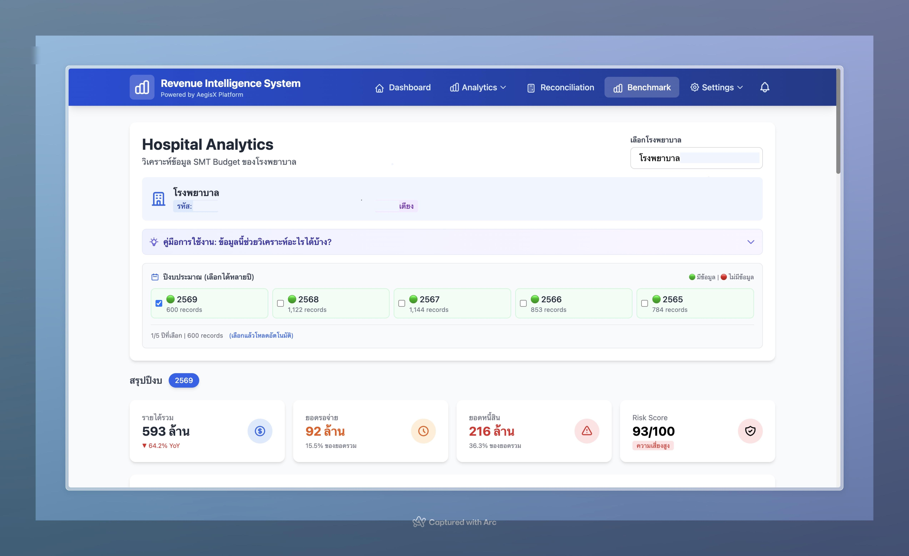
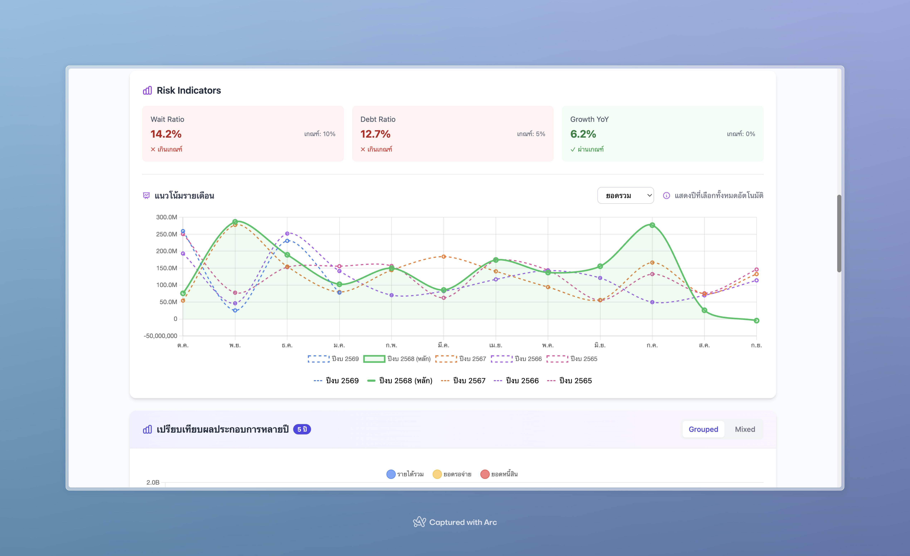
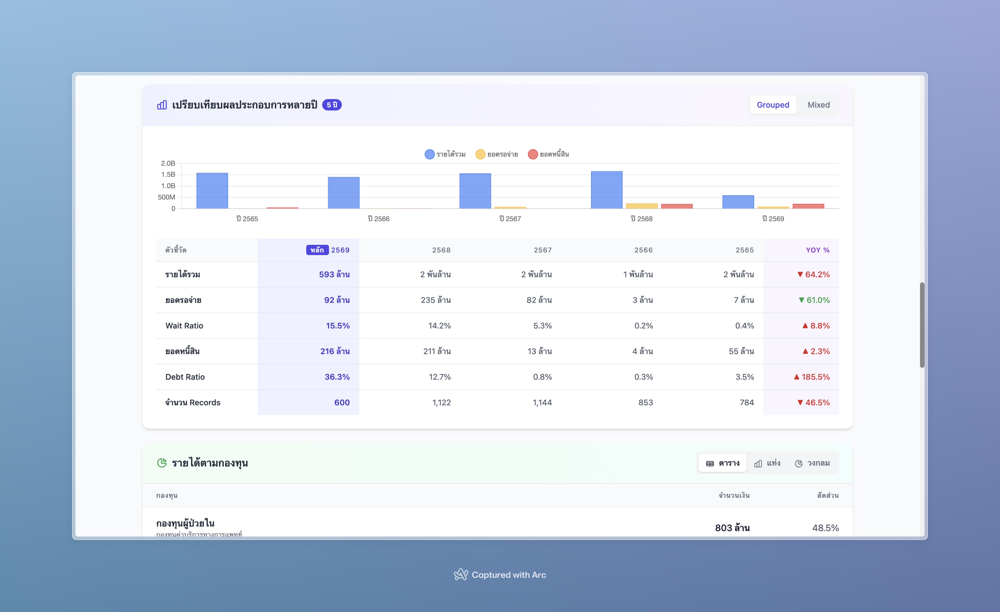
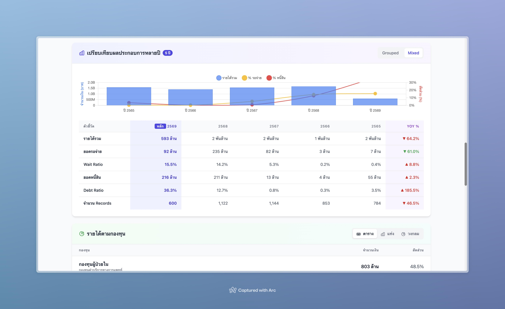
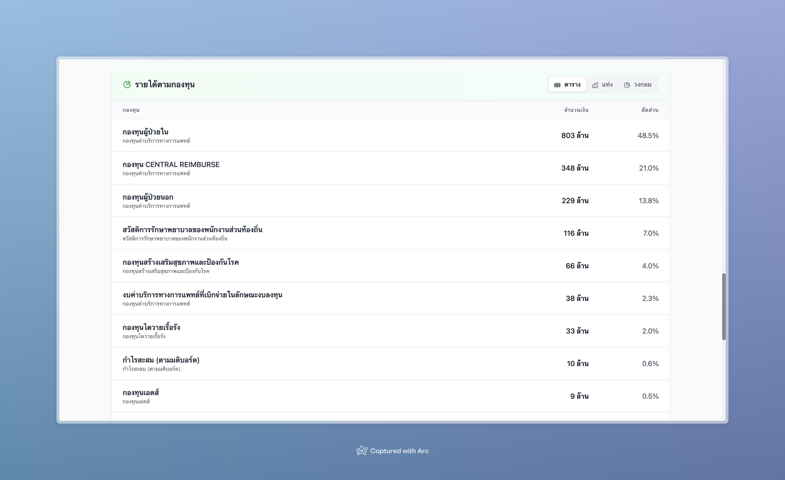
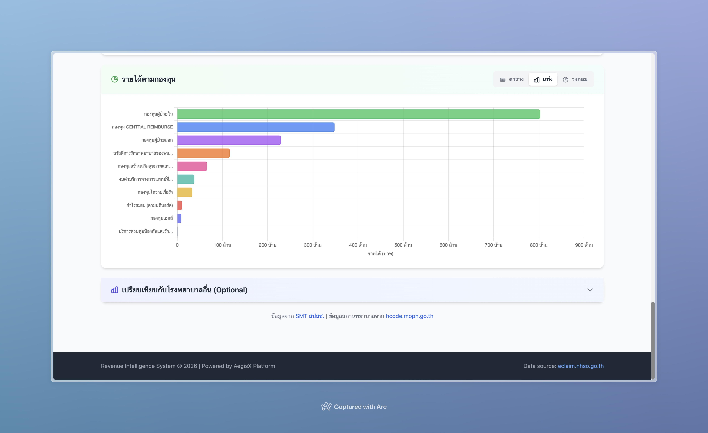
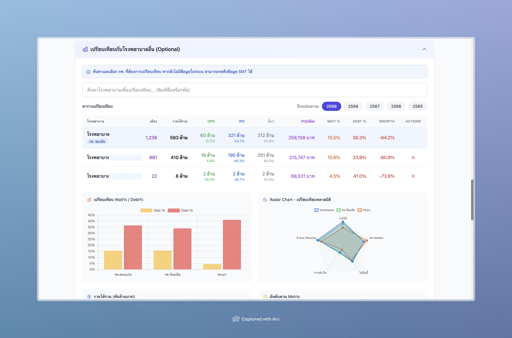
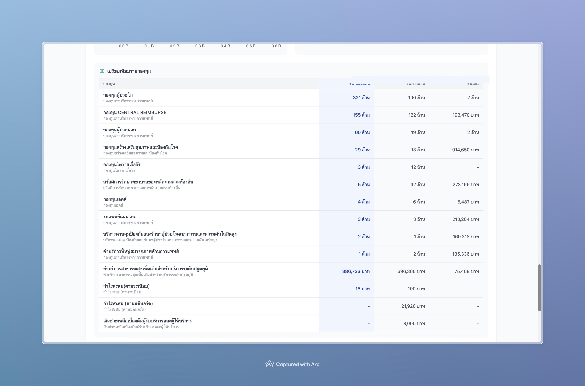
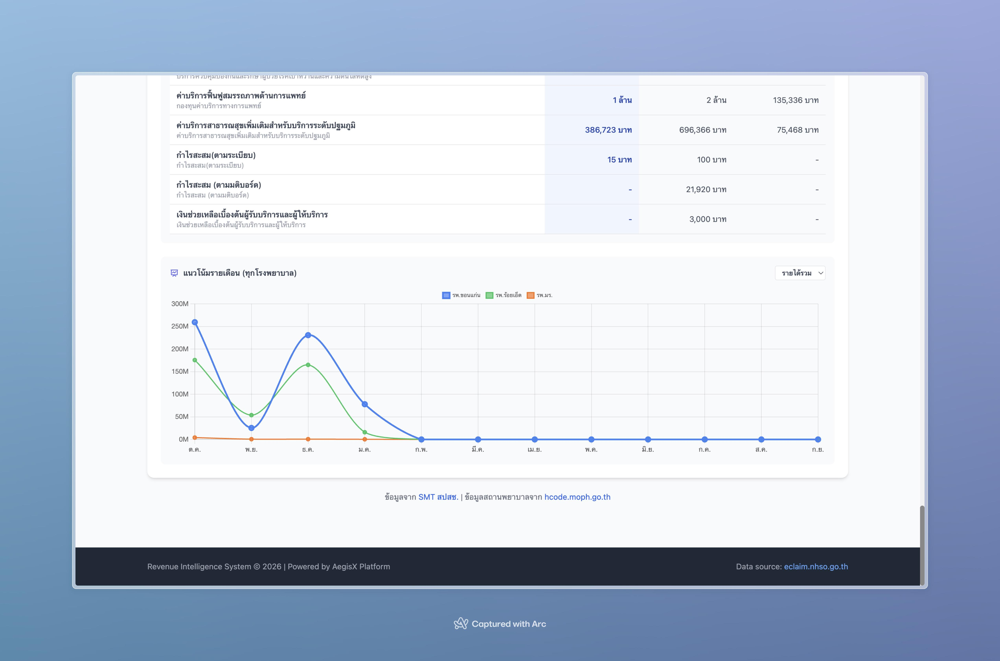

# Revenue Intelligence System

<p align="center">
  
  
  
  
</p>

<p align="center">
  <strong>ระบบวิเคราะห์รายได้จากการเบิกจ่าย สปสช. สำหรับโรงพยาบาล</strong><br>
  วิเคราะห์ REP, STM, SMT อัตโนมัติ พร้อม Dashboard และ Analytics
</p>

---

## 📸 Screenshots

<p align="center">
  
</p>

<details>
<summary><b>📊 ดู Screenshots เพิ่มเติม</b></summary>












</details>

---

## ✨ Features

### 📊 Dashboard & Analytics
- **Revenue Dashboard** - KPIs รายได้รวม, Per-Bed Performance
- **DRG Analytics** - วิเคราะห์รายได้ตาม DRG, RW
- **Drug Analytics** - วิเคราะห์การเบิกยานอกบัญชี
- **Denial Analytics** - วิเคราะห์สาเหตุการปฏิเสธจ่าย
- **Fund Analytics** - วิเคราะห์รายได้ตามกองทุน

### 🔄 Reconciliation
- **REP vs SMT** - เปรียบเทียบข้อมูลเบิกกับข้อมูลจ่าย
- **ตรวจสอบความครบถ้วน** - หารายการที่หายไป
- **Budget Tracking** - ติดตามงบประมาณ SMT

### 📥 Auto Download
- **REP Files** - ดาวน์โหลดไฟล์เบิกอัตโนมัติ
- **STM Files** - ดาวน์โหลดไฟล์ Statement
- **SMT Budget** - ดาวน์โหลดข้อมูลงบประมาณ
- **Scheduler** - ตั้งเวลาดาวน์โหลดอัตโนมัติ

### 🏆 Benchmark
- **เปรียบเทียบกับโรงพยาบาลอื่น** - ดูตำแหน่งของเราเทียบกับ รพ. ในจังหวัด/เขต
- **Per-Bed Metrics** - วิเคราะห์ประสิทธิภาพต่อเตียง

---

## 🚀 Quick Install

### One-Line Installation (Recommended)

```bash
curl -fsSL https://raw.githubusercontent.com/aegisx-platform/revenue-intelligence-system/main/install.sh | bash
```

หรือระบุ path ที่ต้องการติดตั้ง:

```bash
curl -fsSL https://raw.githubusercontent.com/aegisx-platform/revenue-intelligence-system/main/install.sh | bash -s -- --dir /opt/revenue-intelligence
```

### ใช้ External Database (PostgreSQL/MySQL)

หากมี Database Server อยู่แล้ว:

```bash
curl -fsSL https://raw.githubusercontent.com/aegisx-platform/revenue-intelligence-system/main/install.sh | bash -s -- --no-db
```

แล้วแก้ไข `.env`:

```env
DB_TYPE=postgresql  # หรือ mysql
DB_HOST=your-db-server.local
DB_PORT=5432        # หรือ 3306 สำหรับ MySQL
DB_NAME=eclaim_db
DB_USER=eclaim
DB_PASSWORD=your_password
```

📖 **ดูรายละเอียดเพิ่มเติม:** [Installation Guide](docs/INSTALLATION.md)

### Requirements

- **Docker** 20.10+ & **Docker Compose** 2.0+
- **RAM** 2GB+ (แนะนำ 4GB)
- **Disk** 10GB+ สำหรับข้อมูล
- **Network** เข้าถึง eclaims.nhso.go.th

### Supported Platforms

| Platform | Status |
|----------|--------|
| Ubuntu 20.04+ | ✅ Recommended |
| Debian 11+ | ✅ Supported |
| CentOS 8+ / RHEL 8+ | ✅ Supported |
| macOS 12+ | ✅ Supported |
| Windows (WSL2) | ✅ Supported |

---

## 📦 Installation Steps

การติดตั้งจะดำเนินการดังนี้:

```
[1/7] Check Docker           ✓ ตรวจสอบ Docker
[2/7] Create directory       ✓ สร้าง folder
[3/7] Download config        ✓ ดาวน์โหลด docker-compose
[4/7] Configure credentials  ✓ ตั้งค่า username/password
[5/7] Start services         ✓ เริ่ม containers
[6/7] Wait for startup       ✓ รอระบบพร้อม
[7/7] Import seed data       ✓ นำเข้าข้อมูลพื้นฐาน
```

หลังติดตั้งเสร็จ:
1. เปิด http://localhost:5001/setup
2. ใส่รหัสโรงพยาบาล 5 หลัก
3. เริ่มใช้งานได้เลย!

---

## 📁 Data Persistence

ข้อมูลจะถูกเก็บไว้นอก container:

| Directory | Description |
|-----------|-------------|
| `./downloads/` | ไฟล์ REP, STM, SMT ที่ดาวน์โหลด |
| `./logs/` | Log files |
| `./data/` | Settings และข้อมูลระบบ |
| `./config/` | **License file** (`license.lic`) |

> ⚠️ **สำคัญ:** อย่าลบ folder `config/` เพราะมีไฟล์ license อยู่!

---

## 🔐 License

ระบบนี้ต้องมี License ในการใช้งาน

### License Tiers

| Tier | Features |
|------|----------|
| **Trial** | ทดลองใช้ 30 วัน, ฟีเจอร์พื้นฐาน |
| **Basic** | SMT Budget, Analytics พื้นฐาน |
| **Professional** | + Reconciliation, Scheduler |
| **Enterprise** | + API Access, Custom Reports, Priority Support |

### ติดต่อซื้อ License

- 📧 Email: sales@aegisxplatform.com
- 🌐 Website: https://aegisxplatform.com

---

## 🛠️ Commands

```bash
# ดู logs
docker compose logs -f web

# Restart
docker compose restart web

# Stop
docker compose down

# Update to latest version
docker compose pull && docker compose up -d

# Backup database
docker compose exec db pg_dump -U eclaim eclaim_db > backup.sql

# Reset admin password
docker compose exec web python scripts/create_user.py -u admin -p "NewPass123!" --update

# สร้าง user ใหม่
docker compose exec web python scripts/create_user.py -u newuser -p "Pass123!" --name "Name" --role user
```

📖 **ดู commands ทั้งหมด:** [Command Reference](docs/COMMANDS.md)

---

## 📚 Documentation

- [Installation Guide](docs/INSTALLATION.md)
- [Configuration Guide](docs/CONFIGURATION.md)
- [API Documentation](docs/API.md)
- [Troubleshooting](docs/TROUBLESHOOTING.md)

---

## 🏥 About

**Revenue Intelligence System** พัฒนาโดย [AegisX Platform](https://aegisxplatform.com) 
สำหรับโรงพยาบาลที่ต้องการวิเคราะห์รายได้จากการเบิกจ่าย สปสช. อย่างมีประสิทธิภาพ

---

<p align="center">
  <strong>© 2026 AegisX Platform. All rights reserved.</strong>
</p>
